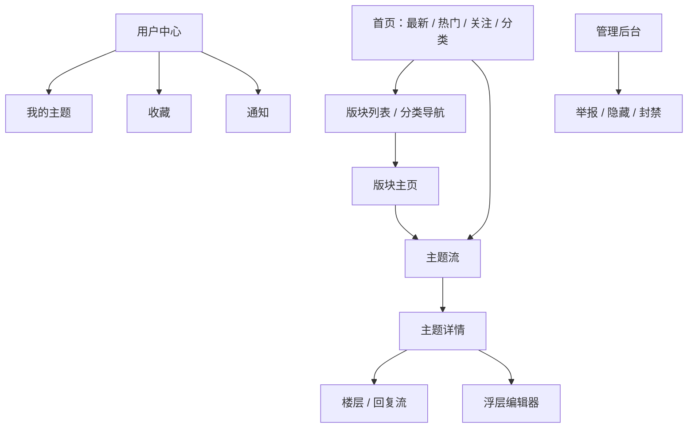
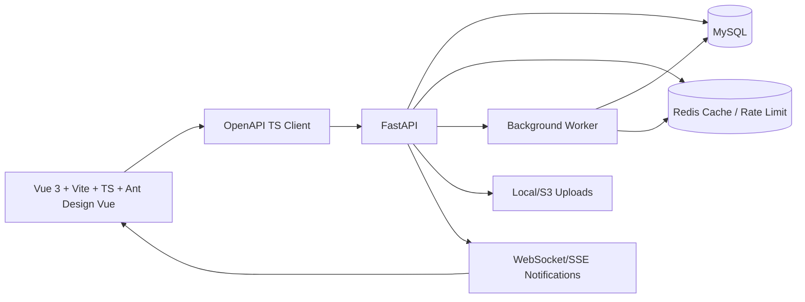

# 平行线论坛项目设计（Vue 3 + FastAPI）

> 目标：参考 Discourse Meta 的信息架构与 `D:\work\discourse` 开源源码，把“论坛/版块/主题/楼层”的中文社区体验，设计成可用 Trellis 拆解推进的现代全栈项目。

## 1. 参考依据

### 线上产品参考：Discourse Meta

- 首页导航以 `Latest / Top / Categories / Hot / Votes` 为核心入口，说明论坛首页应围绕“时间流、榜单、分类、热度、投票/反馈”组织信息。
- Categories 页面每个分类都展示名称、说明、主题数，说明分类/版块不仅是导航，还承担内容治理和语义归档。
- Guidelines、Terms、Privacy 常驻底部，说明社区产品从第一版就要有规则、举报、权限和隐私承诺。

### 开源代码参考：`D:\work\discourse`

关键模型与设计借鉴：

| Discourse 源码 | 可复用思想 | 本项目映射 |
|---|---|---|
| `D:\work\discourse\app\models\topic.rb` | Topic 是主题聚合根，含标题、分类、状态、可见性、缩略图、通知委托 | `topics` 表作为帖子主贴/主题 |
| `D:\work\discourse\app\models\post.rb` | Post 归属于 Topic/User，支持楼层号、回复、动作、修订、上传 | `posts` 表承载主贴正文与回帖楼层 |
| `D:\work\discourse\app\models\category.rb` | Category 有颜色、权限、父子层级、标签约束、专题列表 | `boards` 表对应“版块”，可有父级与运营配置 |
| `D:\work\discourse\app\models\tag.rb` | Tag 有 topic_count、可见性、同义词、分类关联 | `tags/topic_tags` 支持跨版块话题聚合 |
| `D:\work\discourse\app\models\topic_user.rb` | 用户-主题维度记录已读、通知级别、是否参与 | `topic_reads/topic_subscriptions` |
| `D:\work\discourse\app\models\notification.rb` | 通知是类型化事件，并可合并、优先级排序 | `notifications` + WebSocket/SSE |
| `D:\work\discourse\app\controllers\posts_controller.rb` | 创建帖子由服务对象统一处理，并返回序列化结果 | FastAPI service 层统一发帖/回帖事务 |
| `D:\work\discourse\app\serializers` | API 输出由 serializer 层稳定结构 | Pydantic response schema + OpenAPI |

## 2. 产品定位

**平行线**：面向开发者、技术社区或兴趣圈子的“主题式论坛”（代码仓库和内部包名沿用 ParallelLines/parallellines）。它保留中文论坛的低门槛发帖、关注版块、楼层回复、热帖榜；吸收 Discourse 的分类清晰、主题流、通知级别、社区治理和可扩展 API。

### 核心用户

1. 游客：浏览热门版块、热门帖、搜索内容。
2. 注册用户：关注版块、发主题、回复、点赞、收藏、设置通知。
3. 版主/分区版主：置顶、加精、隐藏、处理举报、维护版块介绍。
4. 管理员：用户管理、全站分类、内容安全、审计日志。

## 3. MVP 范围

### 必做

- 用户注册、登录、刷新 token、当前用户资料。
- 版块列表、版块主页、关注/取消关注版块。
- 主题帖：创建、详情、列表、标签、置顶/加精状态。
- 回帖：楼层号、回复指定楼层、编辑、软删除。
- Markdown 编辑器，服务端渲染/净化 HTML，代码块使用深色样式。
- 点赞、收藏、浏览数、回复数、最后回复时间。
- 最新、热门、精华、我的关注信息流。
- 搜索：标题、正文、版块、标签、作者。
- 通知：被回复、被提及、主题新回复、版块新帖。
- 举报、隐藏、封禁、审计日志基础版。

### 暂不做

- 即时聊天、复杂插件系统、多站点、多语言后台、移动原生 App、复杂积分商城。

## 4. 信息架构



## 5. 技术架构



### 推荐目录

```text
D:\work\ParallelLines\
  apps\
    api\                 # FastAPI app
      app\
        api\v1\          # routers by domain
        core\            # config, security, logging
        db\              # session, base, migrations glue
        models\          # SQLAlchemy models
        schemas\         # Pydantic DTOs
        services\        # business transactions
        repositories\    # query objects
        workers\         # async jobs
        tests\
      alembic\
      pyproject.toml
    web\                 # Vue 3 app
      src\
        app\             # app bootstrap/router/providers
        pages\           # route pages
        features\        # board/topic/post/user modules
        entities\        # typed domain models
        shared\          # UI primitives, utils, api client
      package.json
  .trellis\
    spec\product\       # versioned product/architecture specs
```

## 6. 核心数据模型

| 表 | 关键字段 | 说明 |
|---|---|---|
| `users` | `id, username, email, password_hash, avatar_url, role, status` | 账号主体 |
| `user_profiles` | `user_id, bio, reputation, location, links` | 展示资料 |
| `boards` | `id, slug, name, description, color, avatar_url, owner_id, visibility, topic_count, post_count, follower_count` | 版块/分类，借鉴 Discourse Category |
| `board_members` | `board_id, user_id, role, notification_level, joined_at` | 关注版块、版主/分区版主 |
| `topics` | `id, board_id, user_id, title, slug, status, pinned, featured, view_count, reply_count, hot_score, last_posted_at` | 主题帖，借鉴 Discourse Topic |
| `posts` | `id, topic_id, user_id, parent_id, post_number, raw_md, cooked_html, reply_count, like_count, deleted_at` | 主贴和回帖，第一楼也是 Post |
| `tags` / `topic_tags` | `name, slug, topic_count` | 跨版块聚合 |
| `topic_reads` | `topic_id, user_id, last_read_post_number, notification_level` | 已读和通知设置，借鉴 TopicUser |
| `reactions` | `target_type, target_id, user_id, type` | 点赞/表情反应 |
| `bookmarks` | `user_id, topic_id/post_id` | 收藏 |
| `notifications` | `user_id, type, topic_id, post_id, actor_id, data, read_at` | 类型化通知 |
| `flags` | `target_type, target_id, reporter_id, reason, status` | 举报与审核 |
| `audit_logs` | `actor_id, action, target_type, target_id, payload` | 管理审计 |
| `uploads` | `user_id, path, mime_type, size, checksum` | 图片/附件 |

## 7. API 设计

统一约定：

- 路径前缀：`/api/v1`。
- 返回：`{ "data": ..., "meta": ... }`，错误：`{ "error": { "code", "message", "details" } }`。
- 分页：列表默认 cursor pagination；管理后台可用 page/size。
- 鉴权：HTTP-only refresh cookie + access token；内部服务使用 scope。
- OpenAPI：FastAPI 自动生成，前端由 OpenAPI 生成 typed client。

| 模块 | Endpoint | 说明 |
|---|---|---|
| Auth | `POST /auth/register`, `POST /auth/login`, `POST /auth/refresh`, `POST /auth/logout` | 账号会话 |
| Users | `GET /me`, `GET /users/{username}`, `GET /users/{username}/topics` | 用户资料与动态 |
| Boards | `GET /boards`, `POST /boards`, `GET /boards/{slug}`, `POST /boards/{slug}/follow` | 版块浏览与关注 |
| Topics | `GET /topics?sort=latest|hot|top`, `POST /boards/{slug}/topics`, `GET /topics/{id}-{slug}` | 主题流与发帖 |
| Posts | `GET /topics/{topic_id}/posts`, `POST /topics/{topic_id}/posts`, `PATCH /posts/{id}` | 回帖与编辑 |
| Actions | `PUT /posts/{id}/like`, `PUT /topics/{id}/bookmark`, `POST /flags` | 互动/举报 |
| Search | `GET /search?q=&board=&tag=&author=` | 搜索 |
| Notifications | `GET /notifications`, `PUT /notifications/read`, `GET /notifications/stream` | 通知/SSE |
| Admin | `GET /admin/reports`, `PATCH /admin/flags/{id}`, `PATCH /admin/users/{id}` | 审核后台 |

## 8. 前端体验设计

### 设计方向

**Calm Tech Forum / 冷静技术社区**：浅灰画布减少白光，蓝色作为默认行动色，极客绿作为成功和在线状态，帖子正文以清晰排版为主，代码块模拟编辑器深色预览。

### 语言与内容约定

- 平行线默认面向中文技术社区，产品 UI、导航、状态、空状态、示例主题和种子内容统一使用简体中文。
- 英文仅保留在品牌名、协议/API/代码标识符、包名、命令、错误码，以及 FastAPI、OpenAPI、Vue、Markdown 等通用技术名词中。
- 借鉴 Discourse Meta 的信息架构，不复制其英文文案；中文内容应体现“版块、主题、楼层、关注、追踪、投票、举报”等中文论坛语境。

### 色彩 Token

```css
:root {
  --bg-app: #F8FAFC;
  --bg-surface: #FFFFFF;
  --bg-subtle: #EEF2F7;
  --primary: #409EFF;
  --primary-hover: #66B1FF;
  --accent-geek: #10B981;
  --title: #334155;
  --text: #475569;
  --muted: #6B7280;
  --border: #E5E7EB;
  --code-bg: #1E1E1E;
  --code-text: #D4D4D4;
  --danger: #EF4444;
  --warning: #F59E0B;
  --radius-card: 16px;
  --shadow-card: 0 12px 30px rgba(17, 24, 39, 0.08);
}
```

### 页面布局

- 顶部：Logo、搜索框、`最新/热门/分类/关注`、通知、发帖按钮。
- 左栏：我的关注版块、热门标签、社区规则。
- 中栏：主题列表/详情主内容。
- 右栏：热榜、活跃用户、版主公告。
- 移动端：底部导航 + 发帖浮动按钮。

### 核心组件

UI 基础采用 Ant Design Vue，并通过 `ConfigProvider` 注入平行线色彩 token；业务组件在 Ant Design Vue 之上做轻量封装。

| 组件 | 说明 |
|---|---|
| `AppShell` | 顶部导航、三栏栅格、响应式容器 |
| `BoardCard` | 版块头像、描述、统计、关注按钮 |
| `TopicList` / `TopicCard` | 标题、版块、标签、作者、回复/热度、最后回复 |
| `TopicDetail` | 主帖、状态条、楼层导航 |
| `PostItem` | 楼层、回复引用、动作栏、折叠删除态 |
| `ComposerDrawer` | 新主题/回复复用编辑器，支持 Markdown 预览 |
| `MarkdownRenderer` | 服务端 cooked HTML 展示，代码块深色 |
| `NotificationBell` | 未读计数与实时下拉 |
| `ModerationPanel` | 举报处理和审计摘要 |

## 9. 关键业务规则

- 发主题 = 创建 `topic` + 第 1 条 `post`，必须单事务完成。
- 回帖写入时更新 `topics.reply_count / last_posted_at / hot_score`。
- 每个用户在每个主题维护 `last_read_post_number`，用于新回复提示。
- 通知级别：`muted / normal / tracking / watching`，优先级：主题设置 > 版块设置 > 默认设置。
- 软删除优先；物理删除仅管理员定时清理或合规要求触发。
- Markdown 渲染必须服务端净化，禁止原始 HTML 和危险 URL。
- 热度分 = 时间衰减 + 回复 + 点赞 + 收藏 + 浏览 + 加精/置顶权重。

## 10. 非功能要求

- 性能：主题列表 P95 < 300ms；主题详情首屏 P95 < 500ms；长帖楼层虚拟滚动。
- 安全：密码强哈希、JWT 过期、CSRF/同源策略、速率限制、输入净化、上传 MIME 校验。
- 可观测：结构化日志、请求 ID、慢查询日志、后台任务指标。
- 可维护：每个 API 有 schema、service、测试；前端 feature-sliced 模块化。
- 可访问性：键盘可达、语义按钮、色彩对比、代码块可复制。

## 11. 里程碑

1. **M0 设计基线**：本文档、Trellis 任务树、开发规范。
2. **M1 基础设施**：FastAPI/Vue 单仓骨架、数据库、鉴权、CI。
3. **M2 核心内容闭环**：版块、主题、回帖、列表、详情、编辑器。
4. **M3 社区互动**：关注、点赞、收藏、通知、已读状态。
5. **M4 发现与治理**：搜索、热榜、举报、管理后台。
6. **M5 发布准备**：Docker Compose、seed 数据、E2E、性能和安全检查。
