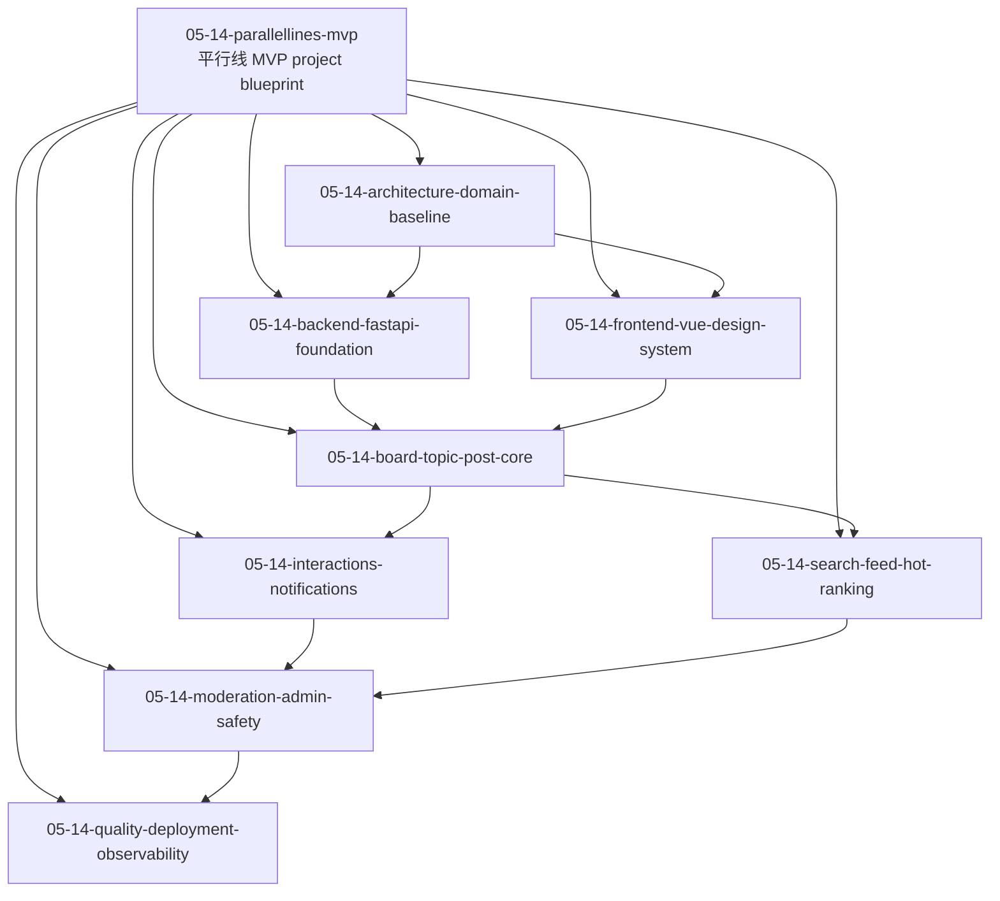

# Trellis 开发任务树

> 已在 `D:\work\ParallelLines\.trellis\tasks` 中创建任务目录，并为每个任务初始化 Trellis context 文件。

## 任务总览



## 执行原则

- 每个任务只负责一组清晰文件；避免多个任务同时改同一模块。
- 先完成架构/规范，再并行做 `backend-fastapi-foundation` 与 `frontend-vue-design-system`。
- `board-topic-post-core` 是第一个端到端闭环，必须串起 API、DB、前端页面和测试。
- 所有跨层任务必须阅读 `.trellis/spec/guides/cross-layer-thinking-guide.md`。
- 每个任务结束前运行对应 lint/test，并更新 PRD 的验收状态。

## 任务明细

| 任务目录 | 优先级 | 类型 | 主要交付 | 验收标准 |
|---|---:|---|---|---|
| `05-14-parallellines-mvp` | P0 | fullstack | 项目总 PRD、里程碑、子任务依赖 | 子任务树完整，PRD 能指导团队开工 |
| `05-14-architecture-domain-baseline` | P0 | docs | 架构、领域模型、API/错误/权限规范 | 文档覆盖 MVP 范围、数据模型、API 契约 |
| `05-14-backend-fastapi-foundation` | P0 | backend | FastAPI 骨架、SQLAlchemy/Alembic、Auth、配置、日志 | `/healthz`、Auth happy path、迁移和单测通过 |
| `05-14-frontend-vue-design-system` | P0 | frontend | Vue 3 骨架、路由、Pinia/Query、设计 token、基础组件 | 首页壳和组件展示页可运行，满足配色要求 |
| `05-14-board-topic-post-core` | P0 | fullstack | 版块/主题/回帖模型、API、页面、编辑器 | 可创建版块、发主题、回帖并在页面展示 |
| `05-14-interactions-notifications` | P1 | fullstack | 点赞、收藏、关注、已读、通知、SSE/WS | 互动可乐观更新，通知能实时到达/标记已读 |
| `05-14-search-feed-hot-ranking` | P1 | fullstack | 搜索、最新/热门/精华流、热度任务 | 搜索和榜单可分页，热度分可解释并可测试 |
| `05-14-moderation-admin-safety` | P1 | fullstack | 举报、审核、软删除、封禁、审计 | 版主/管理员权限正确，审核操作有日志 |
| `05-14-quality-deployment-observability` | P1 | fullstack | CI、Docker Compose、E2E、监控、发布清单 | 一键本地启动，测试门禁和部署文档齐全 |

## 推荐并行批次

1. **Batch 1**：`architecture-domain-baseline`
2. **Batch 2**：`backend-fastapi-foundation` 与 `frontend-vue-design-system` 并行
3. **Batch 3**：`board-topic-post-core`
4. **Batch 4**：`interactions-notifications` 与 `search-feed-hot-ranking` 并行
5. **Batch 5**：`moderation-admin-safety`
6. **Batch 6**：`quality-deployment-observability`

## 常用命令

```powershell
# 查看 Trellis 上下文
python .trellis\scripts\get_context.py

# 查看任务
python .trellis\scripts\task.py list

# 开始某个任务
python .trellis\scripts\task.py start 05-14-backend-fastapi-foundation

# 校验任务上下文
python .trellis\scripts\task.py validate 05-14-board-topic-post-core
```
